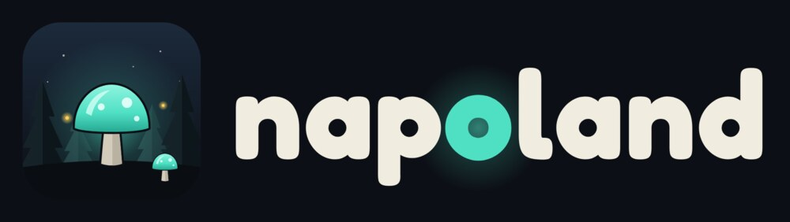

# napoland brand

The logo is a glowcap, the first thing that glows out there, in the firs at night. The wordmark is napoland in Fredoka Bold, always lowercase, with its **o** glowing the glowcap's teal.

## Files

| File | Use it for |
|---|---|
| `mark.svg` | The icon on its own, rounded: favicons, app icons, stickers |
| `mark-square.svg` | The icon full bleed: profile pictures (sites crop it round), maskable app icons |
| `logo-horizontal.svg` | The main logo, on dark backgrounds |
| `logo-horizontal-on-night.svg` | The same on its own night background, to drop anywhere |
| `logo-horizontal-ink.svg` | The main logo on light backgrounds |
| `logo-stacked*.svg` | The icon above the wordmark, for square and tall spaces |
| `wordmark-cream.svg`, `wordmark-ink.svg` | The name alone, on dark or light |
| `wordmark-white.svg`, `wordmark-black.svg` | One color, for print, embroidery, stamps |

Every SVG has its letters as outlines, so none needs the font installed.

The game uses `apps/client/public/`: `favicon.svg`, `favicon.ico`, `apple-touch-icon.png`, `icon-192.png`, `icon-512.png`, `icon-maskable-512.png`, `site.webmanifest`, and `og.jpg` (the picture a shared link shows).

## Colors

The game's own colors, from `apps/client/src/style.css` and the world.

| | Hex | Where |
|---|---|---|
| Night | `#0c0f15` | Backgrounds, outlines |
| Panel | `#151a22` | Cards, buttons |
| Cream | `#f1ece0` | The wordmark, text on dark |
| Sand | `#d3ccbb` | Second text |
| Glowcap teal | `#4fe0c4` | The glowing **o**, what glows |
| Glowcap light | `#8ff3df` | The cap's highlight |
| Glowcap deep | `#27a893` | The **o** on light backgrounds |
| NAPO yellow | `#ffcf5a` | Wisps, calls to action, NAPO's signs |
| Sodium orange | `#e0873a` | Street lights |

## Type

- **Fredoka** (Bold, 700) for the logo and headlines.
- **Nunito** (ExtraBold, 800) for lines of text.

Both are in the game and under the SIL Open Font License.

## Please

- Keep space around the logo, at least the height of the **o**.
- Use the cream logo on dark, the ink logo on light. Not on busy pictures without a dark shade behind it.
- Do not recolor, stretch, rotate, outline or add shadows to it, and do not write napoland with a capital N in the logo.
- The glowcap stays teal. The **o** is the only colored letter.
